<div align="center">

# Fundamentals of Backend Architecture — A Deep Dive

**A clear, beginner-friendly guide to how modern backends really work**

_By Rajon Talukdar_

</div>

---

## Table of Contents

1. [What Is "Backend Architecture"?](#0-what-is-backend-architecture)
2. [Stateful Servers](#1-stateful-servers)
3. [Stateless Servers](#2-stateless-servers)
4. [Load Balancing](#3-load-balancing)
5. [Nginx in Practice](#4-nginx-in-practice)
6. [Scaling: Vertical vs Horizontal](#5-scaling-vertical-vs-horizontal)
7. [Microservices Architecture](#6-microservices-architecture)
8. [Authentication & Authorization](#7-authentication--authorization)
9. [File Serving, CDNs & Object Storage](#8-file-serving-cdns--object-storage)
10. [Event Brokers & Async Communication](#9-event-brokers--async-communication)
11. [Caching](#10-caching)
12. [Rate Limiting](#11-rate-limiting)
13. [Databases: SQL vs NoSQL](#12-databases-sql-vs-nosql)
14. [Putting It All Together](#13-putting-it-all-together)
15. [Glossary](#glossary)

---

## 0. What Is "Backend Architecture"?

When you open an app and tap a button, something somewhere has to **store your data, run the logic, and send back an answer**. That "somewhere" is the **backend** — the part of a system the user never sees directly.

> **Analogy:** A restaurant.
> - The **frontend** is the dining room — menus, tables, the waiter you talk to.
> - The **backend** is the kitchen — where ingredients are stored, food is cooked, and orders are coordinated.
> You never walk into the kitchen, but the quality of your meal depends entirely on how well it's organized.

**Backend architecture** is the set of decisions about how those kitchen pieces — servers, databases, caches, queues — are arranged so the system stays **fast, reliable, and able to grow**.

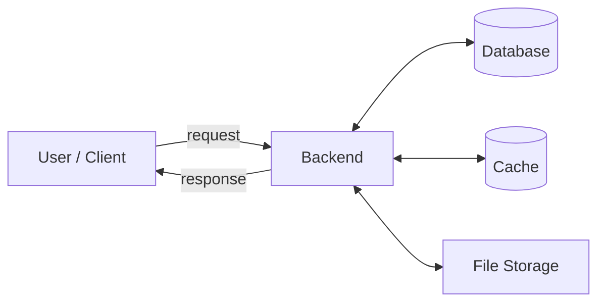

The rest of this guide walks through the building blocks one at a time, then shows how they snap together.

---

## 1. Stateful Servers

A **stateful** server **remembers things about you between requests**. It keeps your session — who you are, what's in your cart — in its own memory (RAM).

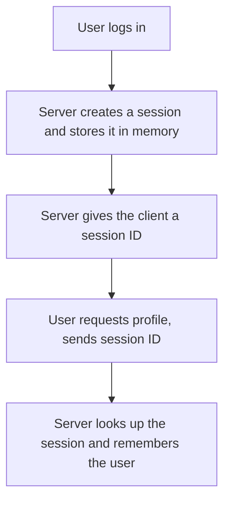

> **Analogy:** A barista who remembers your usual order. Great — *as long as you always go to the same barista*. If that person isn't working today, the new barista has no idea who you are.

**Why this matters:** the session lives on **one specific server**. That single fact causes most of the trade-offs below.

| ✅ Advantages | ❌ Disadvantages |
| --- | --- |
| Simple to build and reason about | Hard to scale — sessions are tied to one machine |
| Works well for traditional web apps | If that server crashes, sessions are lost |
| Fast lookups (data is already in RAM) | Load balancer must always send you back to the *same* server ("sticky sessions") |

**When to use it:** small apps, internal tools, or systems where you control the whole environment and traffic is predictable.

---

## 2. Stateless Servers

A **stateless** server **remembers nothing between requests**. Every request must carry *everything* the server needs to handle it — usually a **token** that proves who you are.

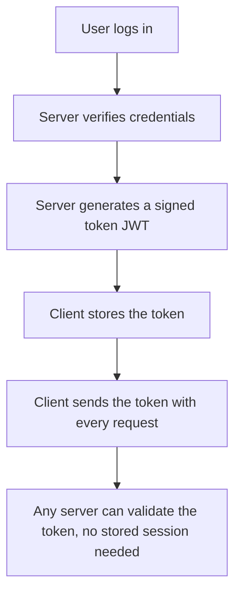

> **Analogy:** A concert wristband. Once you have it, *any* staff member at *any* gate can check it and let you in. Nobody needs to "remember" you — the proof is on your wrist.

### What is a JWT?

A **JWT (JSON Web Token)** is a small, signed string with three parts: `header.payload.signature`.
- The **payload** holds data like your user ID and the token's expiry time.
- The **signature** is created with a secret key only the server knows, so the token **can't be faked or tampered with**.

Because the token itself proves who you are, **any** server can handle **any** request.

| ✅ Advantages | ❌ Disadvantages |
| --- | --- |
| Easy horizontal scaling — any server handles any request | You must manage token lifetime and renewal |
| Great for mobile apps & APIs | Can't easily "force logout" a token before it expires |
| Cloud-friendly, plays well with load balancers | Token data is visible (signed, not encrypted) — don't store secrets in it |

**When to use it:** almost all modern APIs, mobile backends, and anything that needs to scale across many servers.

---

## 3. Load Balancing

When **one server can't handle all the traffic**, you run **several** and put a **load balancer** in front to spread requests across them.

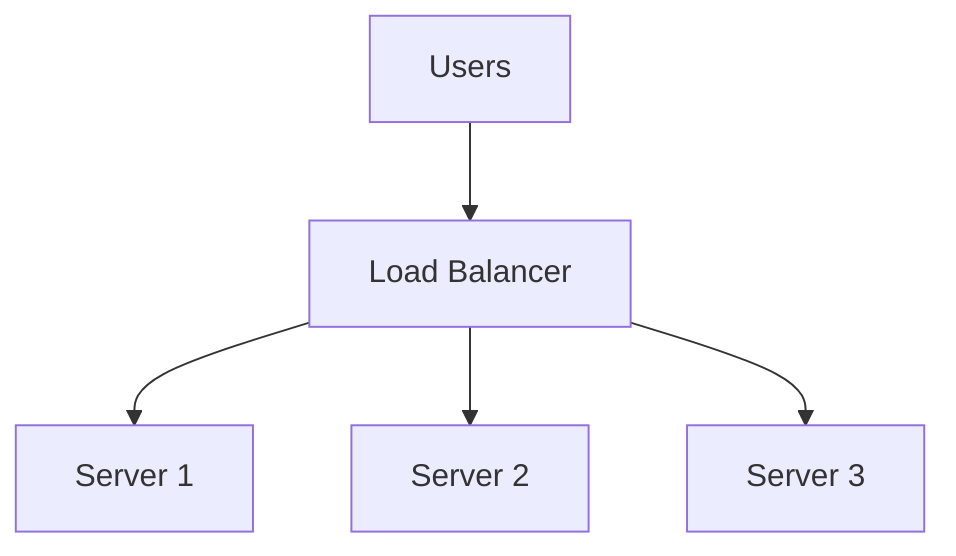

> **Analogy:** A host at a busy restaurant directing arriving guests to whichever table/waiter is free, so no single waiter gets overwhelmed.

### What a load balancer actually does

- **Distribute traffic** — using strategies like *round-robin* (take turns), *least connections* (send to the least busy server), or *IP hash* (same user → same server).
- **Health checks** — it constantly pings each server; if one stops responding, it stops sending traffic there.
- **Failover** — if a server dies, users don't notice because traffic shifts to healthy servers.
- **SSL termination** — it can handle HTTPS encryption/decryption so your app servers don't have to.

**Popular load balancers:** Nginx · HAProxy · Traefik · Envoy (plus cloud ones like AWS ELB).

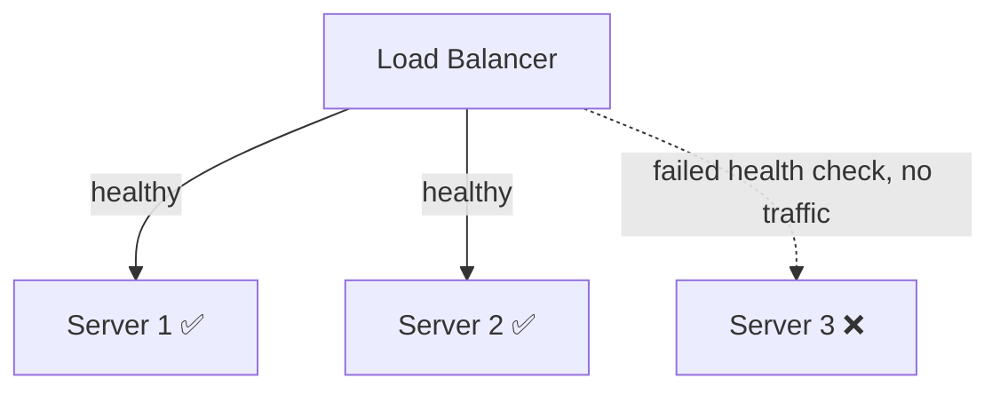

---

## 4. Nginx in Practice

**Nginx** is one of the most widely used pieces of backend infrastructure. It commonly acts as a:
- **Reverse proxy** — receives client requests and forwards them to your app.
- **Load balancer** — spreads requests across multiple app instances.
- **Static file server** — serves images, CSS, and JS very efficiently.

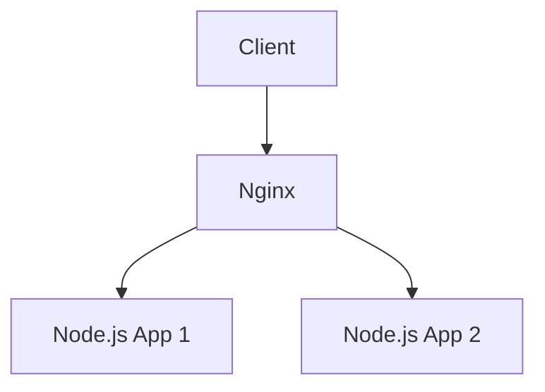

> **Reverse proxy vs forward proxy:** A *forward* proxy hides the *client* (like a VPN). A *reverse* proxy hides the *servers* — clients talk to Nginx and never know how many servers are behind it.

**Example configuration:**

```nginx
# Define a pool of backend app servers
upstream backend {
    server 10.0.0.1:3000;
    server 10.0.0.2:3000;
    server 10.0.0.3:3000;
}

server {
    listen 80;

    location / {
        proxy_pass http://backend;   # forward requests to the pool above
    }
}
```

With this config, Nginx receives every request on port 80 and round-robins it across the three app servers — instant load balancing in a few lines.

---

## 5. Scaling: Vertical vs Horizontal

**Scaling** = making your system handle more load. There are two ways.

### Vertical Scaling — make one server stronger ("scale up")

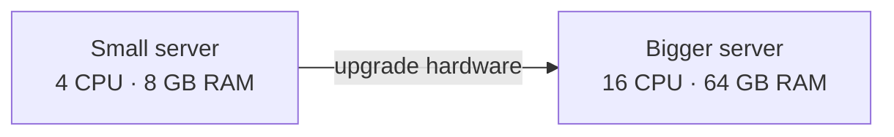

> **Analogy:** Hiring one super-chef and giving them a bigger stove.

| ✅ Advantages | ❌ Disadvantages |
| --- | --- |
| Simple — no code changes needed | Expensive (top-tier hardware costs a lot) |
| No distributed-systems complexity | Hard limit — you can't grow a single machine forever |
| | Single point of failure |

### Horizontal Scaling — add more servers ("scale out")

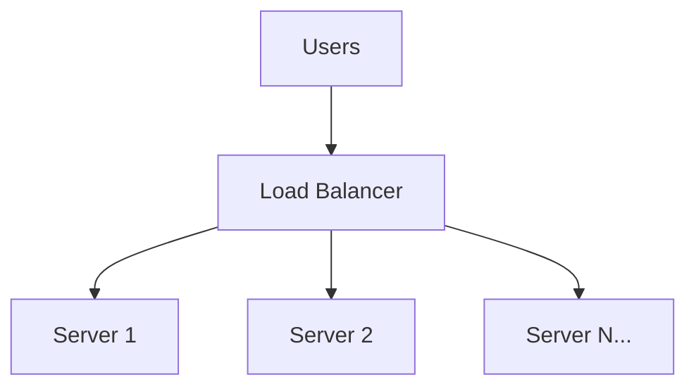

> **Analogy:** Hiring more cooks. If one is out sick, the kitchen keeps running.

| ✅ Advantages | ❌ Disadvantages |
| --- | --- |
| Nearly unlimited growth — just add servers | Requires stateless design (see §2) |
| Fault tolerant — one server failing isn't fatal | More moving parts to manage |
| Often cheaper (commodity hardware) | Needs a load balancer |

**Rule of thumb:** vertical scaling is the quick fix; horizontal scaling is how large systems survive. Most production systems do both.

---

## 6. Microservices Architecture

Instead of building one giant application (a **monolith**), you split it into many small, **independent services** that each own one job.

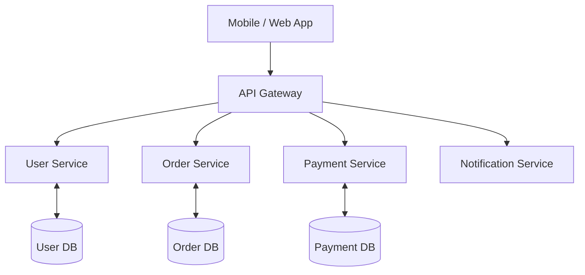

> **Analogy:** A monolith is one person doing cooking, serving, and cashier work. Microservices are a team where each person specializes — the cashier can be replaced or trained without shutting down the kitchen.

### Monolith vs Microservices

| | Monolith | Microservices |
| --- | --- | --- |
| **Deployment** | One big unit | Each service deploys independently |
| **Scaling** | Scale the whole app | Scale only the busy service |
| **Failure** | One bug can crash everything | Failures can be isolated |
| **Best for** | Small teams, early-stage products | Large teams, complex systems |

| ✅ Advantages | ❌ Disadvantages |
| --- | --- |
| Deploy services independently | Higher operational complexity |
| Clear team ownership | Network calls between services can fail/slow |
| Scale each service separately | Harder to monitor and debug across services |

> **Important:** Microservices are **not** automatically "better." Most apps should **start as a monolith** and split into services only when the team and complexity actually demand it.

### The API Gateway

The **API Gateway** is the single front door. It routes requests to the right service and often handles authentication, rate limiting, and logging in one place — so each service doesn't have to.

---

## 7. Authentication & Authorization

These two words sound alike but mean different things:

- **Authentication (AuthN):** *Who are you?* (logging in)
- **Authorization (AuthZ):** *What are you allowed to do?* (permissions)

> **Analogy:** Authentication is showing your ID at the airport. Authorization is whether your ticket lets you into the first-class lounge.

### The login flow

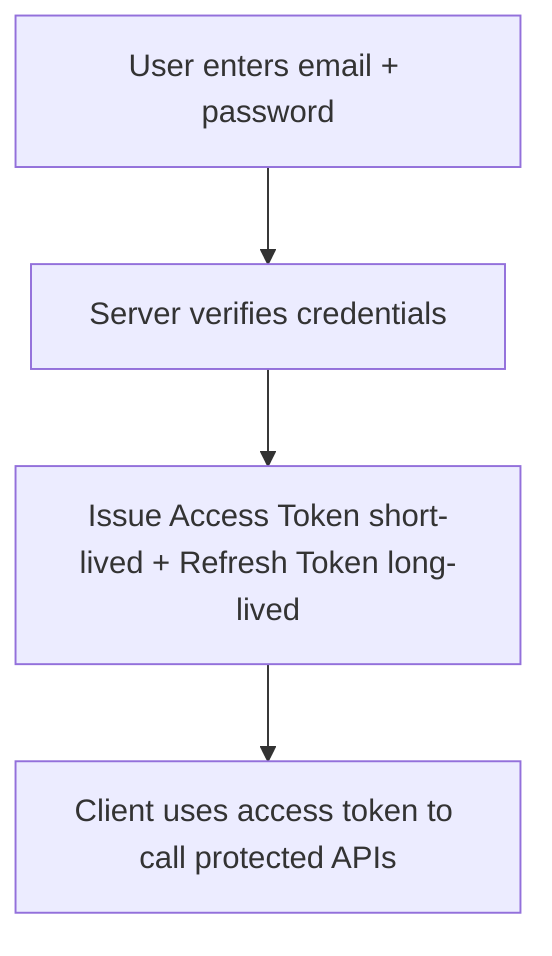

### Access tokens vs refresh tokens

A common, secure pattern uses **two** tokens:

- **Access token** — short-lived (e.g. 15 minutes). Sent with every request. If stolen, it expires quickly.
- **Refresh token** — long-lived (e.g. 30 days). Used **only** to get a new access token when the old one expires.

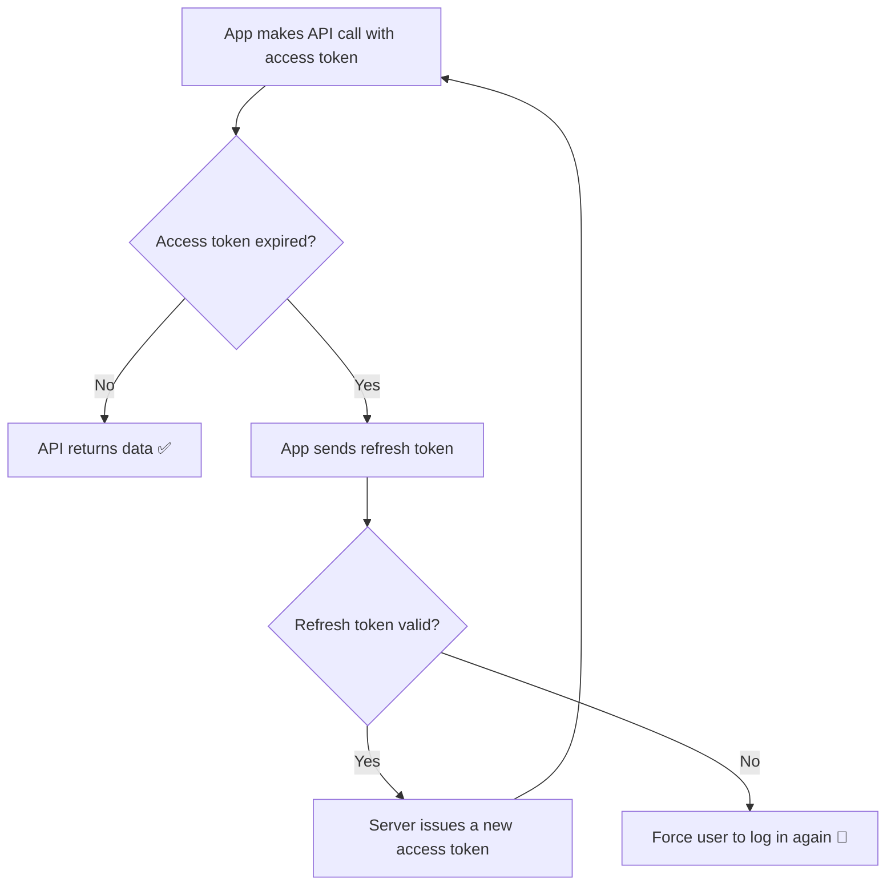

This gives you the best of both: requests stay secure (short access token) without forcing the user to log in constantly (long refresh token).

---

## 8. File Serving, CDNs & Object Storage

Files — images, videos, PDFs, documents — are large and requested often. How you serve them hugely affects performance.

### ❌ Bad approach: store files inside the API server

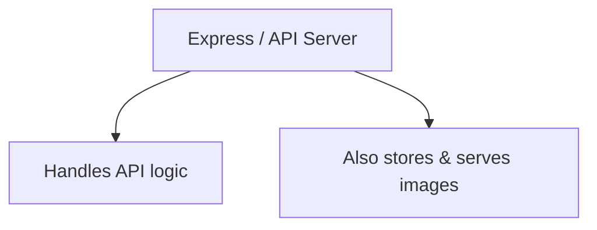

> **Why it's bad:** Your app server burns CPU, memory, and bandwidth shipping big files. Heavy download traffic can starve the server of resources needed for actual logic — and files vanish if that server is replaced.

### ✅ Better approach: object storage + CDN

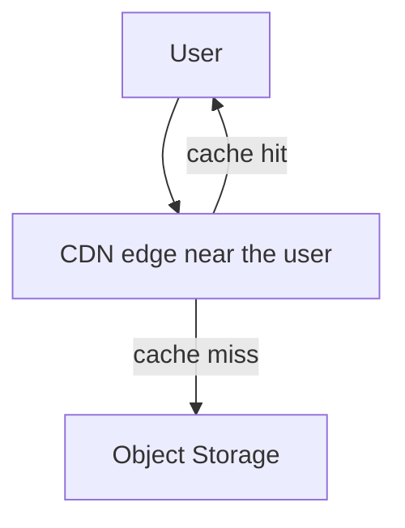

- **Object Storage** = cheap, virtually unlimited, durable file storage. Examples: **Amazon S3**, **Cloudflare R2**, **Google Cloud Storage**.
- **CDN (Content Delivery Network)** = a global network of servers that **cache** your files close to users (see §10).

### Typical upload flow (the secure, scalable way)

Notice the file **never passes through your backend** — the backend just hands out a temporary permission slip.

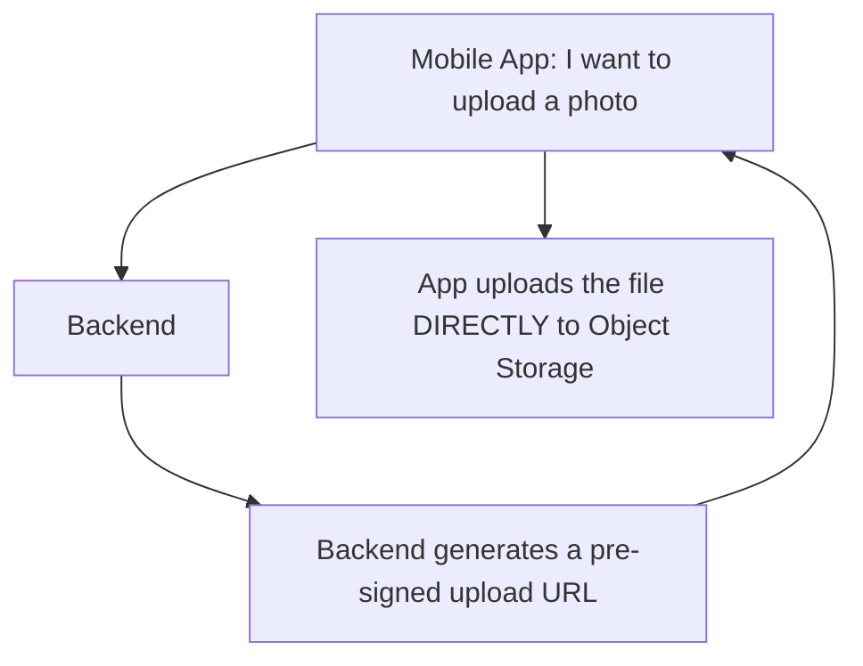

> **Pre-signed URL:** a temporary, single-purpose URL that grants permission to upload one file. This keeps your backend lightweight and your storage credentials secret.

---

## 9. Event Brokers & Async Communication

Sometimes Service A needs to tell Service B that something happened — but A shouldn't have to *wait* for B, or fail if B is down.

### Without a broker (synchronous, tightly coupled)

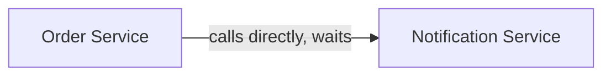

> **Problem:** If the Notification Service is slow or down, the whole order can fail — even though sending an email has nothing to do with whether the order succeeded.

### With a broker (asynchronous, decoupled)

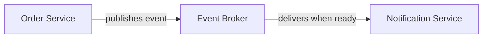

> **Analogy:** Instead of calling someone and waiting for them to pick up, you drop a letter in a mailbox. You move on immediately; the letter gets delivered when the recipient is ready.

The Order Service just announces *"Order Created!"* and moves on. The broker reliably delivers that event — even if the consumer is temporarily down.

### One event, many consumers (publish/subscribe)

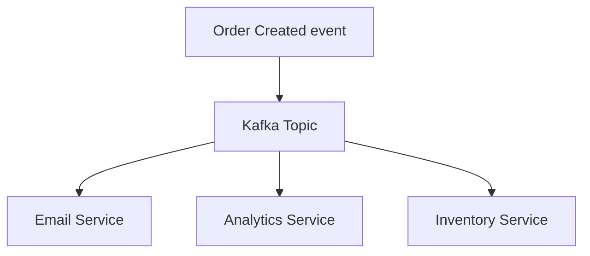

One event fans out to many independent consumers. Want to add a "Fraud Detection" service later? Just subscribe it to the topic — **no change to the Order Service**.

**Popular brokers:** RabbitMQ · Apache Kafka · Redis Pub/Sub · AWS SQS/SNS

| Synchronous (direct call) | Asynchronous (via broker) |
| --- | --- |
| Caller waits for a response | Caller fires and forgets |
| Simple, immediate result | Resilient — survives consumer downtime |
| Failure cascades | Failures are isolated and retryable |

---

## 10. Caching

**Caching** = storing the result of expensive work so you don't have to redo it. It's one of the highest-impact ways to make a backend fast.

### Without cache — every request hits the database

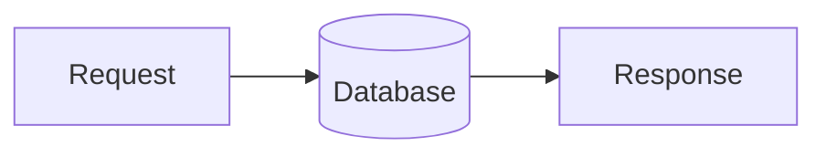

> Databases are powerful but relatively slow and expensive. Reading the *same* data thousands of times per second wastes them.

### With cache — check the fast store first

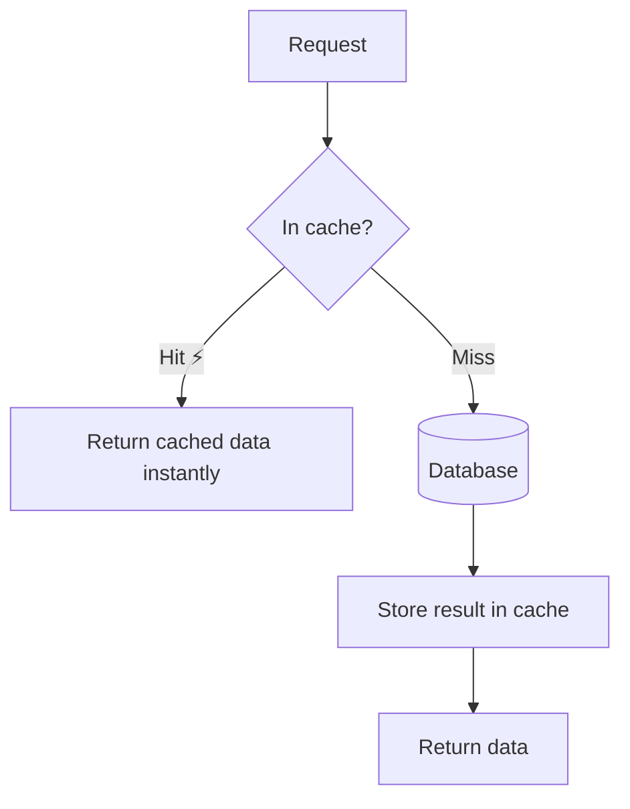

> **Analogy:** Keeping milk in your fridge instead of driving to the store every time you want a glass. The fridge (cache) is right there; the store (database) is the slow fallback.

- A **cache hit** means the data was found in the cache — very fast.
- A **cache miss** means it wasn't, so you fetch from the database and then store it for next time.

**Most popular cache:** **Redis** (an in-memory data store — reads in microseconds).

**Key concept — expiry (TTL):** cached data is given a *time to live*. After it expires, the next request re-fetches fresh data. This balances speed against showing stale information.

### CDNs are caching for files

A **CDN** caches your static files at "edge" locations around the world, so a user in Tokyo loads from a Tokyo server instead of one in Virginia.

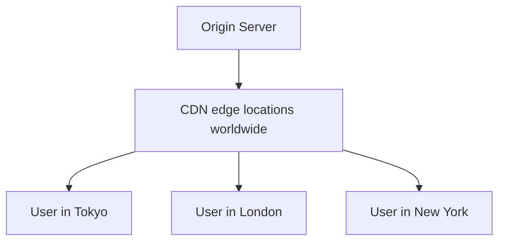

**Benefits:** faster load times · lower origin-server load · better global performance.

**Popular CDNs:** Cloudflare · Amazon CloudFront · Fastly.

---

## 11. Rate Limiting

**Rate limiting** caps how many requests a client can make in a time window. It protects your system from abuse, accidental bugs, and runaway costs.

```mermaid
flowchart TD
    R[Incoming request] --> C{Within limit?<br/>e.g. 100 req / minute}
    C -->|Yes| OK[200 OK — process the request]
    C -->|No| NO[429 Too Many Requests — slow down]
```

> **Analogy:** A nightclub with a maximum capacity. Once it's full, the bouncer makes new arrivals wait — protecting everyone already inside from being crushed.

**Why it matters:**
- Stops a single user (or attacker) from overwhelming your servers (basic DoS protection).
- Prevents one buggy client from accidentally hammering an API.
- Controls cost when you pay per request to downstream services.

**Common strategies:** fixed window, sliding window, **token bucket** (the most common — you get a "bucket" of tokens that refills over time; each request spends one).

The standard HTTP response when a client exceeds the limit is **`429 Too Many Requests`**, often with a `Retry-After` header telling the client when to try again.

---

## 12. Databases: SQL vs NoSQL

Every backend needs to **store data persistently**. The two broad families:

```mermaid
flowchart TD
    DB[Databases] --> SQL[SQL / Relational]
    DB --> NO[NoSQL / Non-relational]
    SQL --> S1[PostgreSQL]
    SQL --> S2[MySQL]
    NO --> N1[MongoDB document]
    NO --> N2[Redis key-value]
    NO --> N3[Cassandra wide-column]
```

| | SQL (Relational) | NoSQL (Non-relational) |
| --- | --- | --- |
| **Structure** | Tables with fixed schema (rows & columns) | Flexible — documents, key-value, graphs |
| **Best for** | Structured data, complex relationships | Rapidly changing or huge-scale data |
| **Consistency** | Strong (ACID transactions) | Often eventual consistency |
| **Examples** | PostgreSQL, MySQL | MongoDB, Cassandra, Redis |
| **Think of it as** | A strict spreadsheet | A flexible folder of JSON files |

> **Beginner advice:** When unsure, start with a relational database like **PostgreSQL**. It's reliable, well-understood, and handles the vast majority of applications well. Reach for NoSQL when you have a specific need it solves better.

**One term you'll hear a lot — ACID** (what makes relational transactions trustworthy):
- **A**tomicity — all steps of a transaction succeed, or none do.
- **C**onsistency — data always follows your rules.
- **I**solation — concurrent transactions don't corrupt each other.
- **D**urability — once committed, data survives crashes.

---

## 13. Putting It All Together

Here's how the pieces combine into a realistic production backend. Follow the arrows to trace a request's journey.

```mermaid
flowchart TD
    M[Mobile / Web App] --> N[Nginx / Load Balancer]
    N --> API[API Servers — stateless, horizontally scaled]

    API --> AUTH[Auth: validate token]
    API --> CACHE[(Cache · Redis)]
    API --> DB[(Database · PostgreSQL)]

    API --> EB[Event Broker · Kafka]
    EB --> EMAIL[Email Service]
    EB --> ANALYTICS[Analytics Service]
    EB --> NOTIF[Notification Service]

    API --> OBJ[Object Storage · S3]
    OBJ --> CDN[CDN]
    CDN --> U[Users Worldwide]
```

### Tracing one request — "load my profile"

1. The app sends a request with its **access token** to the **load balancer**.
2. The load balancer picks a healthy **API server** (any of them — they're stateless).
3. The server **validates the token** (authentication).
4. It checks the **cache** for the profile. **Hit?** Return instantly. **Miss?** Query the **database**, then store the result in the cache.
5. The response goes back to the user. Meanwhile, a *"profile viewed"* event might be dropped onto the **event broker** for analytics — without slowing the user down.
6. The profile picture loads from the **CDN**, served from an edge location near the user.

That's modern backend architecture: **many specialized parts, each doing one job well, arranged so the system stays fast, reliable, and scalable.**

---

## Glossary

| Term | Plain-English meaning |
| --- | --- |
| **Backend** | The server-side part of an app the user doesn't see directly |
| **Stateful** | Server remembers you between requests |
| **Stateless** | Server remembers nothing; each request is self-contained |
| **JWT** | A signed token that proves who you are |
| **Load Balancer** | Spreads incoming traffic across multiple servers |
| **Reverse Proxy** | A server that forwards client requests to backend servers |
| **Vertical Scaling** | Making one server more powerful |
| **Horizontal Scaling** | Adding more servers |
| **Monolith** | One large application containing all logic |
| **Microservice** | A small, independent service that owns one job |
| **API Gateway** | The single entry point that routes requests to services |
| **Authentication** | Verifying *who* you are |
| **Authorization** | Verifying *what* you're allowed to do |
| **CDN** | A global cache that serves files close to users |
| **Object Storage** | Cheap, durable storage for files (e.g. S3) |
| **Event Broker** | Middleware that delivers events between services asynchronously |
| **Cache** | A fast store for frequently used data |
| **Cache hit / miss** | Whether requested data was / wasn't found in the cache |
| **TTL** | "Time to live" — how long cached data stays valid |
| **Rate Limiting** | Capping how many requests a client can make |
| **429** | HTTP status meaning "Too Many Requests" |
| **SQL / NoSQL** | Relational / non-relational database families |
| **ACID** | The guarantees that make database transactions reliable |

---

<div align="center">

_Happy learning! Master these fundamentals and the rest of backend engineering becomes far easier to reason about._

</div>
