<div align="center">

# Fundamentals of Backend Architecture

**Rajon Talukdar**

_June 17, 2026_

</div>

---

## 1. Stateful Servers

A stateful server **remembers information** about a user **between requests**. The server **stores session data in RAM**.

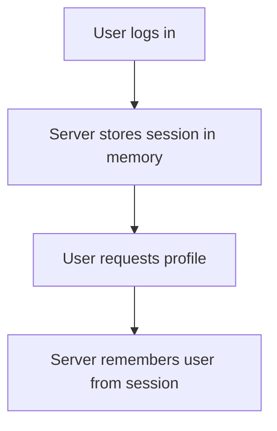

| ✅ Advantages | ❌ Disadvantages |
| --- | --- |
| Easy to implement | Difficult to scale |
| Fits traditional web apps | Session lost if server crashes |
| | Load balancer must pin user to the same server |

---

## 2. Stateless Servers

A stateless server **stores no information** about a user **between requests**. Each request carries everything needed to be processed.

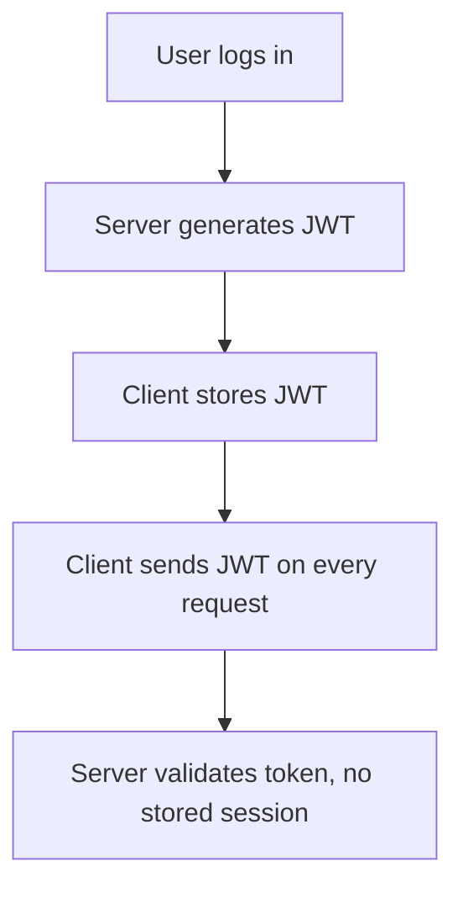

| ✅ Advantages | ❌ Disadvantages |
| --- | --- |
| Easy horizontal scaling | Token management required |
| Great for mobile apps | |
| Cloud-friendly | |

---

## 3. Load Balancing

When one **server cannot handle all traffic**, **requests** are **distributed** across **multiple servers**.

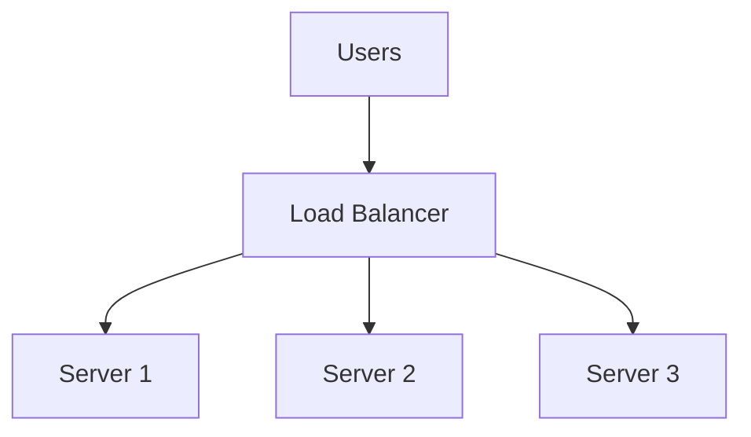

**Responsibilities**

- Distribute traffic
- Health checks
- Failover
- SSL termination

**Popular load balancers:** Nginx · HAProxy · Traefik · Envoy

---

## 4. Nginx Example

Nginx is commonly used as a **reverse proxy**, **load balancer**, and **static file server**.

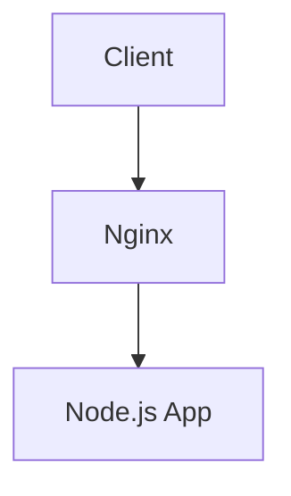

**Example config:**

```nginx
upstream backend {
    server 10.0.0.1:3000;
    server 10.0.0.2:3000;
    server 10.0.0.3:3000;
}

server {
    listen 80;
    location / {
        proxy_pass http://backend;
    }
}
```

---

## 5. Different Types of Scaling

### Vertical Scaling — increase the power of one server

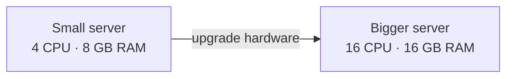

| ✅ Advantages | ❌ Disadvantages |
| --- | --- |
| Easy | Expensive |
| | Hardware limits |

### Horizontal Scaling — add more servers

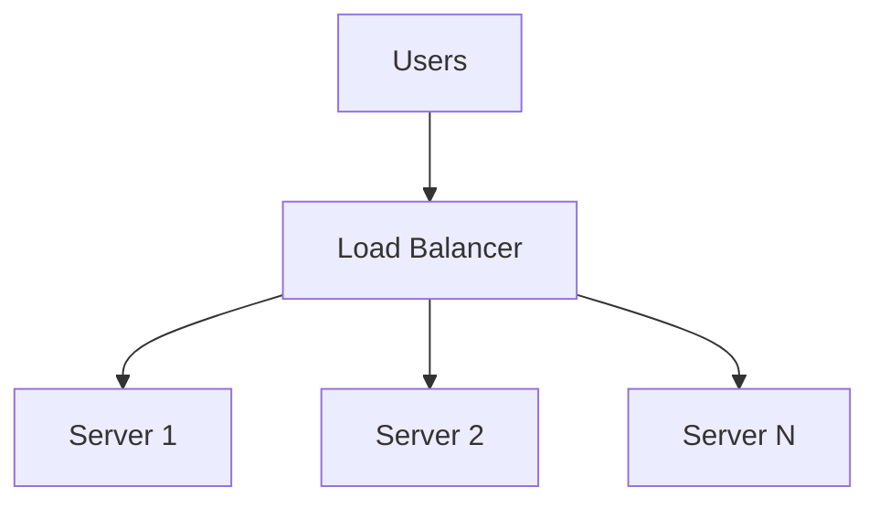

| ✅ Advantages | ❌ Disadvantages |
| --- | --- |
| Highly scalable | More moving parts |
| Fault tolerant | |

---

## 6. Microservices Architecture

Instead of one huge application, split it into independent services.

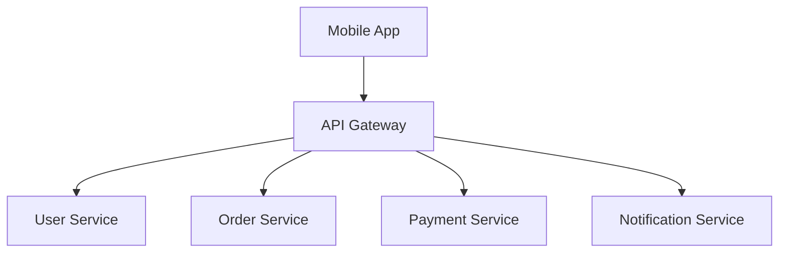

| ✅ Advantages | ❌ Disadvantages |
| --- | --- |
| Independent deployment | Higher complexity |
| Clear team ownership | Network communication overhead |
| Better scalability | Harder to monitor |

---

## 7. Authentication

**Authentication:** *Who you are.* **Authorization:** *What you can do.*

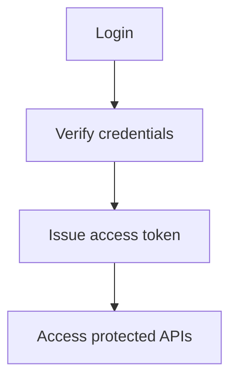

**Modern auth stack — refreshing an expired token:**

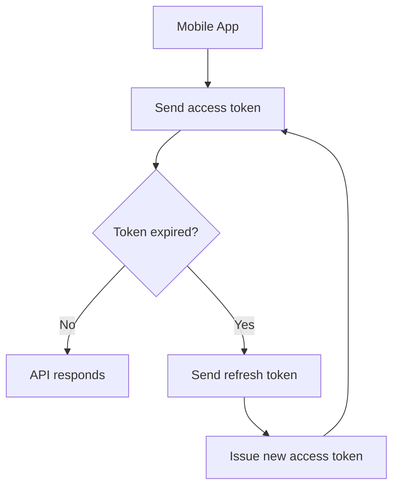

---

## 8. File Serving

Files can be images, videos, PDFs, or documents.

### ❌ Bad approach — store files inside the API server

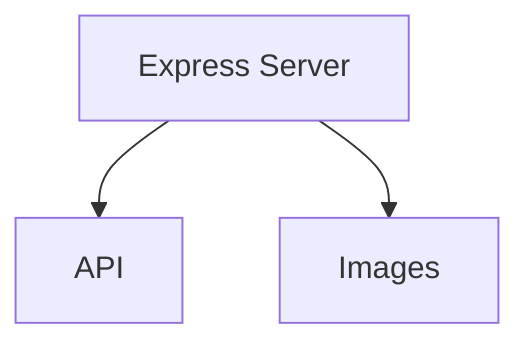

> Heavy traffic can overload the API server.

### ✅ Better approach — serve through a CDN + object storage

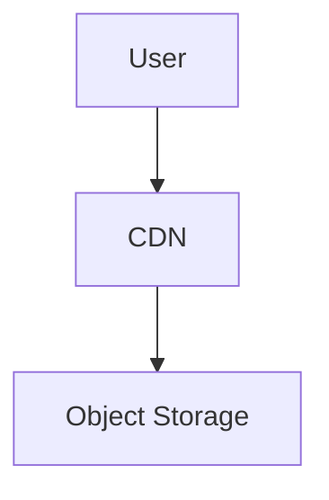

**Examples:** Amazon S3 · Cloudflare R2 · Google Cloud Storage

**Typical upload flow:**

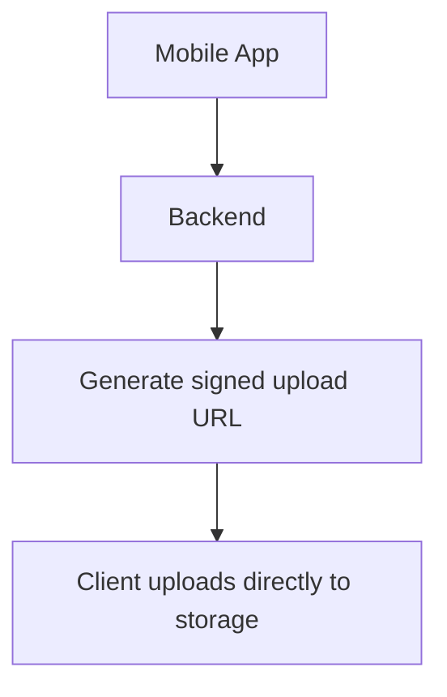

---

## 9. Event Broker

An event broker lets services communicate **asynchronously**.

### Without a broker

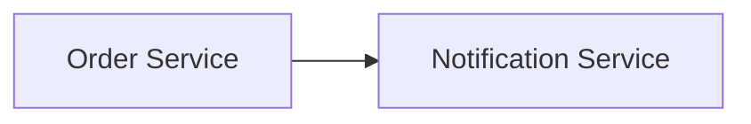

> If the notification fails, the order may fail too.

### With a broker

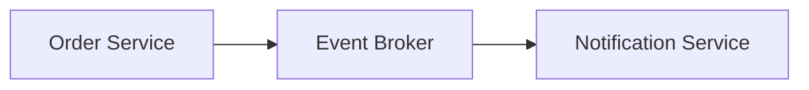

**Popular brokers:** RabbitMQ · Apache Kafka · Redis Pub/Sub

**Example — one event, many consumers:**

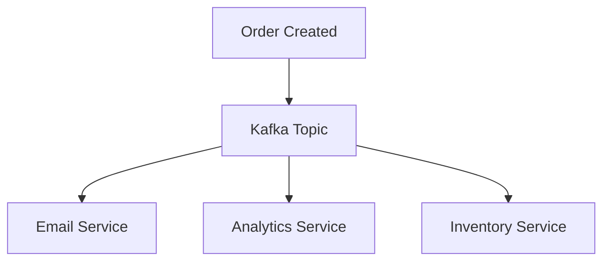

---

## 10. Caching and CDNs

**Caching:** store frequently accessed data close to the application.

### Without cache — every request hits the database

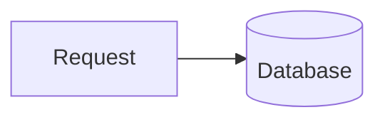

### With cache — database is only hit on a miss

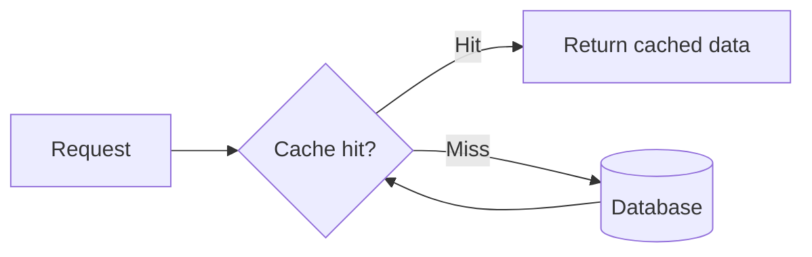

**Popular cache:** Redis

### CDN — store files near users globally

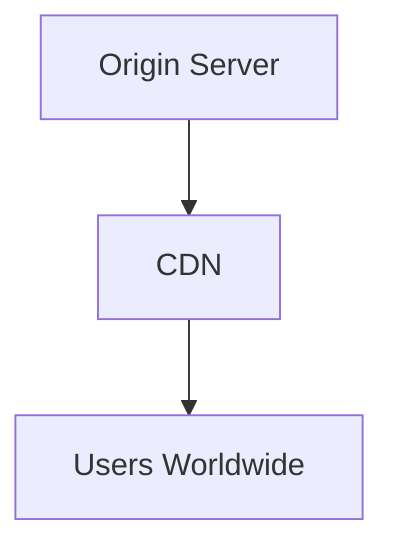

**Benefits:** faster images · lower server load · global performance

**Popular CDNs:** Cloudflare · Amazon CloudFront · Fastly

---

## 11. Rate Limiting

Prevents abuse and protects servers by capping how many requests a client can make.

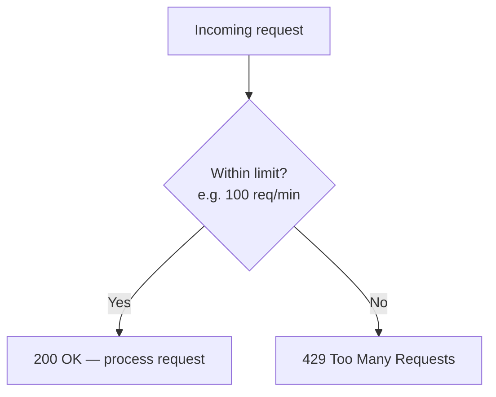

---

## 12. How Everything Fits Together

A modern production backend often looks like this:

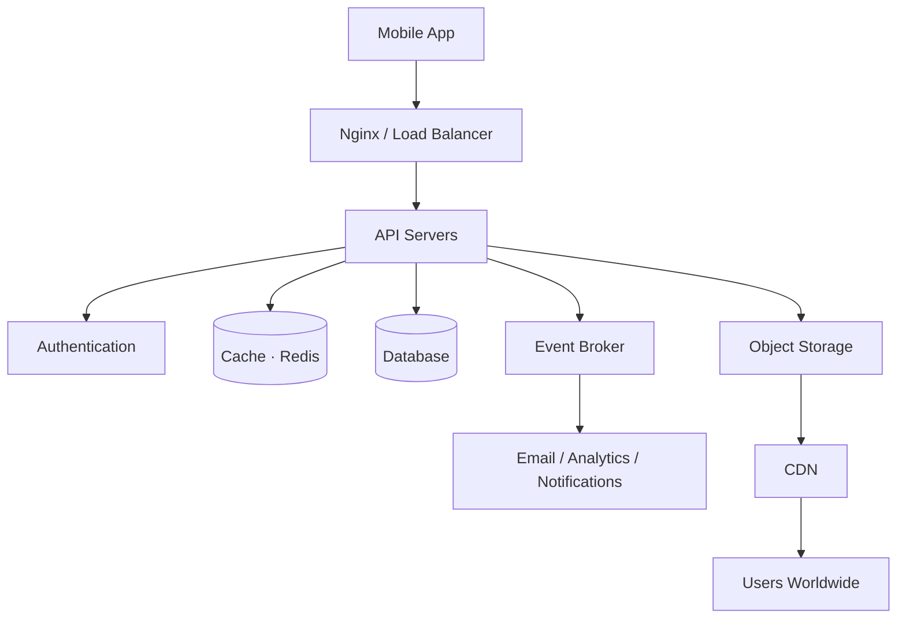
